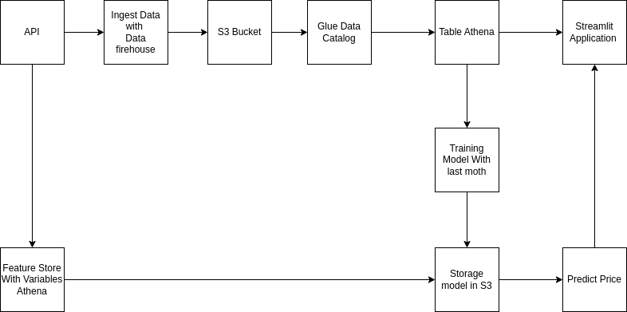

# Previsão de Preço do Bitcoin 🪙

Este projeto utiliza dados históricos de preços do Bitcoin da API CoinGecko e um modelo de Machine Learning treinado para prever os preços futuros do Bitcoin.

## Arquitetura do Projeto

Abaixo está o diagrama da arquitetura do projeto:



## Funcionalidades

- **Previsão do preço do Bitcoin**: O modelo utiliza dados históricos para prever o preço do Bitcoin para dias futuros.
- **Interface Streamlit**: A aplicação possui uma interface interativa com Streamlit, permitindo que o usuário visualize os preços históricos e as previsões de preço para os próximos dias.
- **Integração com S3**: O modelo é carregado diretamente de um bucket S3 utilizando `boto3`, garantindo que sempre esteja disponível e atualizado.

## Tecnologias Utilizadas

- **Streamlit**: Para a interface do usuário interativa.
- **Pandas** e **Numpy**: Para manipulação de dados e cálculos de indicadores financeiros como RSI, médias móveis e volatilidade.
- **Scikit-learn**: Para o modelo de Machine Learning (Modelo de Regressão).
- **boto3**: Para interação com o AWS S3, onde o modelo treinado é armazenado.
- **API CoinGecko**: Para obtenção de dados históricos do Bitcoin.

## Requisitos

- Python 3.x
- Streamlit
- Pandas
- Numpy
- Scikit-learn
- boto3
- requests
- ta (Technical Analysis Library)
- matplotlib


## Project Organization

```
├── LICENSE            <- Open-source license if one is chosen
├── Makefile           <- Makefile with convenience commands like `make data` or `make train`
├── README.md          <- The top-level README for developers using this project.
├── data
│   ├── external       <- Data from third party sources.
│   ├── interim        <- Intermediate data that has been transformed.
│   ├── processed      <- The final, canonical data sets for modeling.
│   └── raw            <- The original, immutable data dump.
│
├── docs               <- A default mkdocs project; see www.mkdocs.org for details
│
├── models             <- Trained and serialized models, model predictions, or model summaries
│
├── notebooks          <- Jupyter notebooks. Naming convention is a number (for ordering),
│                         the creator's initials, and a short `-` delimited description, e.g.
│                         `1.0-jqp-initial-data-exploration`.
│
├── pyproject.toml     <- Project configuration file with package metadata for 
│                         tech_challenge_fase3 and configuration for tools like black
│
├── references         <- Data dictionaries, manuals, and all other explanatory materials.
│
├── reports            <- Generated analysis as HTML, PDF, LaTeX, etc.
│   └── figures        <- Generated graphics and figures to be used in reporting
│
├── requirements.txt   <- The requirements file for reproducing the analysis environment, e.g.
│                         generated with `pip freeze > requirements.txt`
│
├── setup.cfg          <- Configuration file for flake8
│
└── tech_challenge_fase3   <- Source code for use in this project.
    │
    ├── __init__.py             <- Makes tech_challenge_fase3 a Python module
    │
    ├── config.py               <- Store useful variables and configuration
    │
    ├── dataset.py              <- Scripts to download or generate data
    │
    ├── features.py             <- Code to create features for modeling
    │
    ├── modeling                
    │   ├── __init__.py 
    │   ├── predict.py          <- Code to run model inference with trained models          
    │   └── train.py            <- Code to train models
    │
    └── plots.py                <- Code to create visualizations
```

--------

